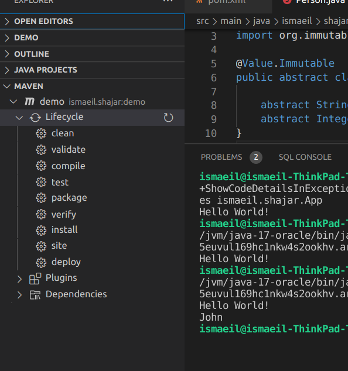

# Immutables
## Environment
after create maven project add immutable value depenancy in depenancies

    <dependency>
        <groupId>org.immutables</groupId>
        <artifactId>value</artifactId>
        <version>${immutables.version}</version>
        <scope>provided</scope>
    </dependency>
then create new abstract class and add @Value to it

```sh
    import org.immutables.value.Value;

    @Value.Immutable
    public abstract class Person {

        abstract String getName();
        abstract Integer getAge();
    }
```
then generate target files , in vscode you can do it by go to Maven and then run compile



