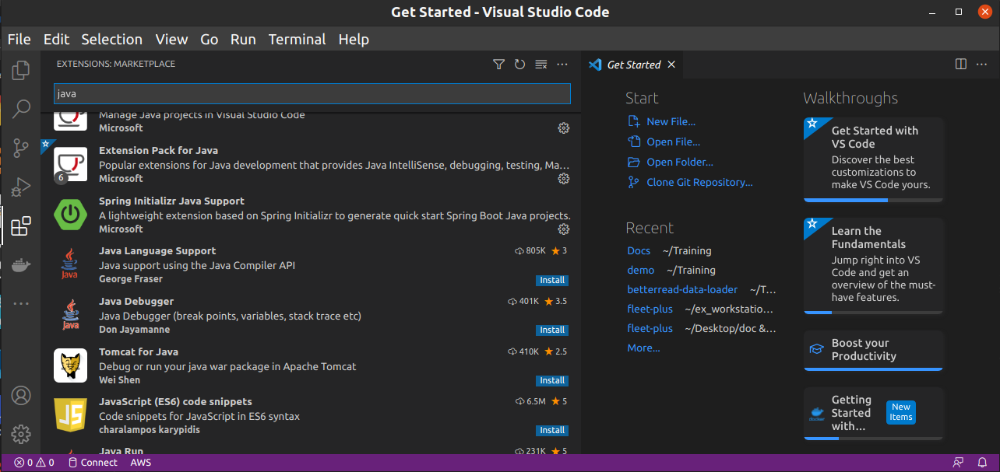
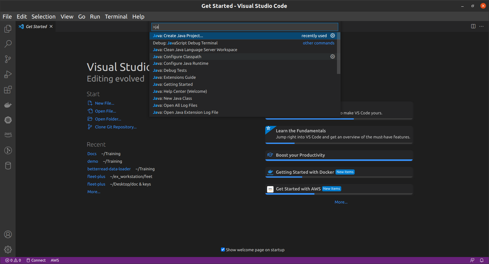
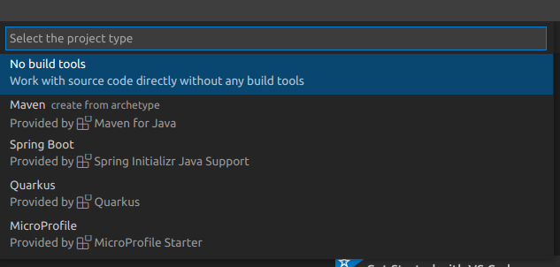
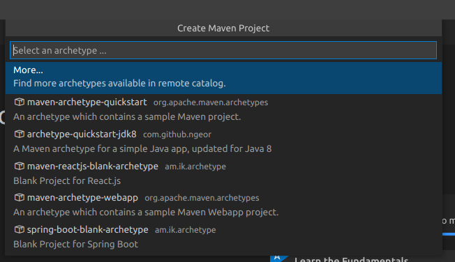

# New java17 app
## create maven application


[](https://travis-ci.org/joemccann/dillinger)

this will be doc about journey in java17

- Type some Markdown on the left
- See HTML in the right
- ✨Magic ✨

## installation

- run mvn to create new project
```sh
mvn archetype:generate -DarchetypeGroupId=org.apache.maven.archetypes -DarchetypeArtifactId=maven-archetype-quickstart -DgroupId=com.shajar -DartifactId=demo
```
- error
- install maven 3.8.3
- download  [maven 3.8.3](https://maven.apache.org/download.cgi)
- copy zip file and extract it in /opt
- add link to /opt/apache-maven-3.8.3
```sh
sudo ln -s /opt/apache-maven-3.8.3 /opt/maven
```
- create fiule to add maven to command line
```sh
sudo nano /etc/profile.d/maven.sh
```
and copy below in file
```sh
export M2_HOME=/opt/maven
export MAVEN_HOME=/opt/maven
export PATH=${M2_HOME}/bin:${PATH}
```
- change file mode to be executable 
```sh
sudo chmod +x /etc/profile.d/maven.sh
```
- now need run source 
```sh
source /etc/profile.d/maven.sh
```
and test mvn -version will be 

>Apache Maven 3.6.3
Maven home: /usr/share/maven
Java version: 17.0.1, vendor: Oracle Corporation, runtime: /usr/lib/jvm/java-17-oracle
Default locale: en_US, platform encoding: UTF-8
OS name: "linux", version: "5.11.0-37-generic", arch: "amd64", family: "unix"

- run mvn again to create project
```sh
mvn archetype:generate -DarchetypeGroupId=org.apache.maven.archetypes -DarchetypeArtifactId=maven-archetype-quickstart -DgroupId=com.shajar -DartifactId=demo
```

## VSCode Steps
- download  Extension Pack for Java from extension

- then open command using [ctrl+shift+A]

- create new maven project

- select archetype quickstart


